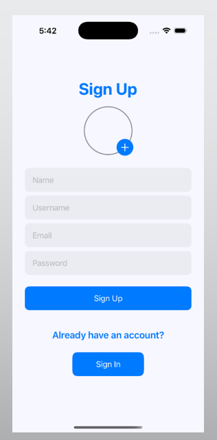
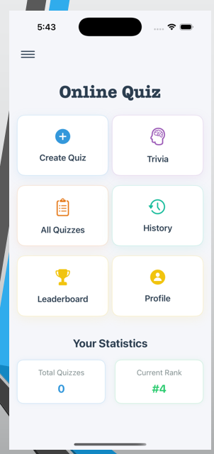
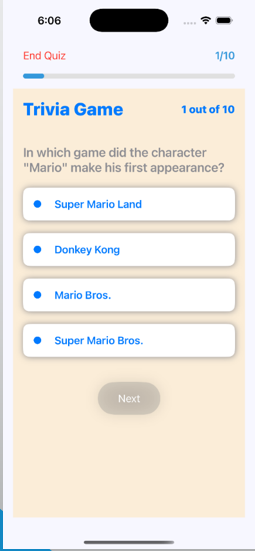
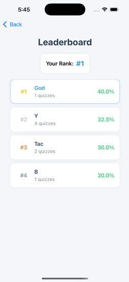

# 📝 Online Quiz App — iOS Mobile Application

An interactive **iOS Quiz Application** built with **SwiftUI** and **Firebase**, featuring dynamic quiz creation, global leaderboards, and collaborative quiz sharing.

---


## 📋 Project Info

| Field | Details |
|-------|---------|
| **Platform** | iOS (SwiftUI) |
| **Backend** | Firebase |

### 👥 Team Members

| Name | Roll |
|------|------|
| Sumaiya Khan | 2007031 |
| Md Kawsar Mahmud Khan | 2007046 |

---

## 📸 Screenshots

| Splash & Auth | Home | Quiz | Leaderboard |
|---------------|------|------|-------------|
|  |  |  |  |

---

## 🌟 Features

| Feature | Description |
|---------|-------------|
| 🎨 Splash Screen | Branded launch screen for smooth app entry |
| 🔐 Authentication | Firebase-powered login, sign-up, and password reset |
| 📝 Quiz Test | Dynamic question fetching with a fresh experience every time |
| 🤝 Quiz Sharing | Upload custom questions accessible to all users |
| 🏆 Global Leaderboard | Ranked by scores and participation |
| 📊 Quiz History & Analytics | Track completed quizzes with titles, timestamps, and scores |
| 👤 Profile Editing | Update profile picture and name directly in-app |

---

## 🔐 Authentication

- **Firebase Authentication** — Secure login, sign-up, and password reset
- **Password Reset UI** — User-friendly reset interface
- **Image Picker** — Integrated using delegate pattern with SwiftUI sheet
- Clean SwiftUI forms for effortless navigation

---

## 🏠 Home & Navigation

- Dashboard showing user stats: quizzes taken and leaderboard rank
- Quick navigation to quizzes, history, and profile
- **Sidebar** for clutter-free access to key features

---

## 📝 Quiz System

- Questions fetched **dynamically** from Firebase
- Users can **cancel anytime** — cancelled quizzes are not saved to history
- Results page with final score on completion
- History logs with quiz title, timestamp, and score

---

## 🤝 Interactive Quiz Sharing

- Users can **upload custom questions** to Firebase
- Uploaded quizzes appear on the **"All Quizzes"** page
- Accessible to all users — fostering a collaborative quiz environment

---

## 🏆 Leaderboard

- Users ranked based on **scores and participation**
- Encourages healthy competition across all users
- Updates in real-time via Firebase

---

## 🛠️ Technology Stack

| Technology | Purpose |
|-----------|---------|
| **SwiftUI** | iOS UI framework |
| **Firebase Authentication** | Secure user login & sign-up |
| **Firebase Firestore** | Real-time database for quizzes & scores |
| **Firebase Storage** | Profile image storage |

---

## 🚀 Getting Started

### Prerequisites
- Xcode 14+
- iOS 16+
- Firebase project configured
- CocoaPods or Swift Package Manager

### Installation

```bash
# Clone the repository
git clone https://github.com/your-username/online-quiz-app.git
cd online-quiz-app

# Install dependencies (if using CocoaPods)
pod install

# Open in Xcode
open OnlineQuiz.xcworkspace
```

### Firebase Setup

1. Create a project at [Firebase Console](https://console.firebase.google.com/)
2. Enable **Authentication** (Email/Password)
3. Enable **Firestore Database**
4. Enable **Storage**
5. Download `GoogleService-Info.plist` and add it to the Xcode project

---

## 📂 Project Structure

```
OnlineQuiz/
├── App/
│   ├── SplashView.swift
│   ├── AuthView.swift
│   └── HomeView.swift
├── Features/
│   ├── Quiz/
│   ├── Leaderboard/
│   ├── History/
│   └── Profile/
├── Models/
├── Services/
│   └── FirebaseService.swift
└── GoogleService-Info.plist
```

---

## 📄 Slides

- 📊 [Presentation Slides (PPTX)](./final__1_.pptx)
